# Arcane GI Labyrinth 최종 과제 보고서

## 1. 프로젝트 개요

Three.js로 만든 3인칭 중세 던전 액션 퍼즐 게임임. 플레이어는 궁수 캐릭터를 조작해서 세 개의 방을 순서대로 통과함. 방마다 규칙을 다르게 넣었고, 단순히 문까지 걸어가는 방식이 아니라 불화살, 전투, 룬 기억, 유리 다리 판별을 거쳐야 다음 구간으로 넘어가게 구성함.

- 프로젝트명: Arcane GI Labyrinth
- 장르: 3D 액션 퍼즐 게임
- 사용 기술: Three.js, GLTFLoader, FBXLoader, Mixamo animation, JavaScript
- GI 기술: Surfel GI 스타일의 표면 기반 동적 조명 연출

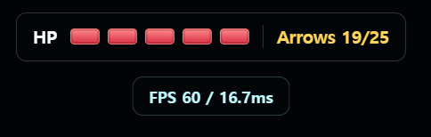

## 2. 게임 기획

전체 진행은 Room 1, Room 2, Room 3 순서임. 각 방은 서로 다른 목표를 가지고 있고, 해당 목표를 해결해야 다음 문이 열림. 그래서 한 방 안에서 끝나는 데모가 아니라, 방을 넘어가며 규칙이 바뀌는 게임 흐름을 만들고자 했음.

### 2.1 Room 1: 불화살 점화 퍼즐

Room 1에서는 세 개의 돌기둥에 불화살을 맞혀야 함. 기둥에 화살이 맞으면 위쪽에 불꽃이 켜지고, 세 기둥이 모두 점화되면 Room 2로 가는 문이 열림. 처음에는 단순 타겟을 맞히는 구조였지만, 최종적으로는 환경 오브젝트와 불화살이 직접 상호작용하는 퍼즐로 바꿈.

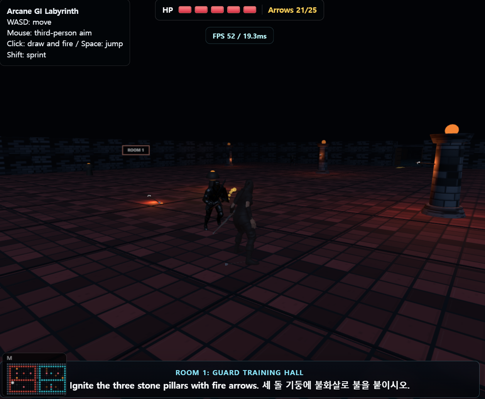

### 2.2 Room 2: 경비병 전투와 룬 기억 퍼즐

Room 2에서는 Paladin 경비병을 처치해야 함. 경비병이 죽으면 그 위치 위에 룬 문자가 홀로그램처럼 뜸. 바닥에 표시하면 시체에 가려서 잘 안 보였기 때문에, 공중에 띄우는 방식으로 수정함. 플레이어는 뜬 룬의 순서를 기억하고 문 앞 입력창에서 비밀번호처럼 입력해야 함.

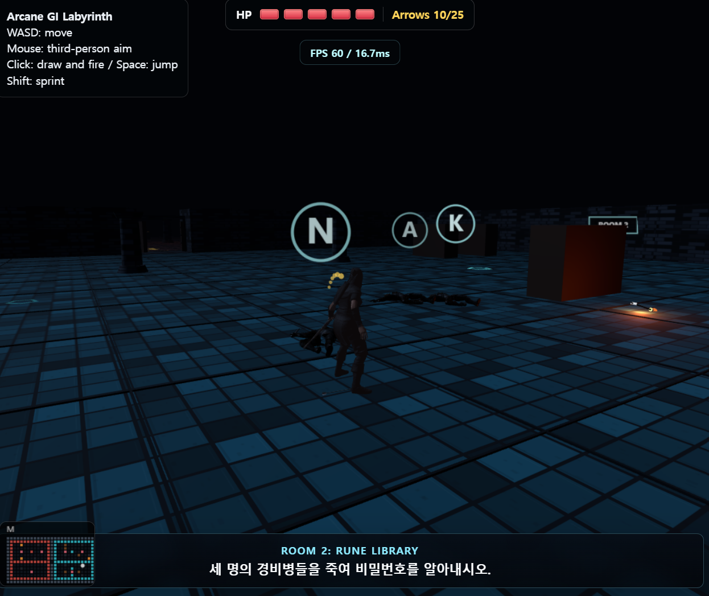

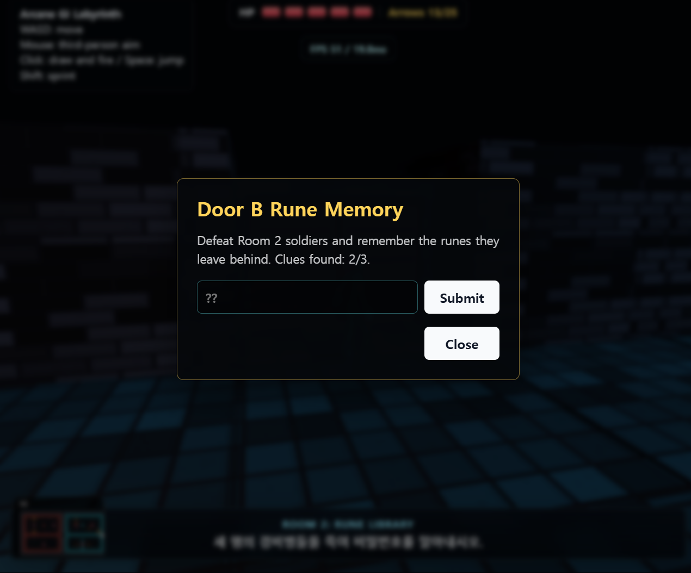

### 2.3 Room 3: 강화유리 판별 다리

Room 3은 유리 다리 구간임. 각 단계마다 좌우 두 장의 유리가 있고, 하나는 강화유리, 하나는 일반 유리임. 플레이어는 제한된 화살로 먼저 유리를 쏴서 확인한 뒤 안전한 칸으로 건너야 함. 화살에 맞았을 때 강화유리는 초록색으로 표시되고, 일반 유리는 빨간색으로 표시됨. 일반 유리를 밟으면 바로 죽는 대신 유리가 깨지고 캐릭터가 떨어지는 연출 후 사망 화면이 나오도록 처리함.

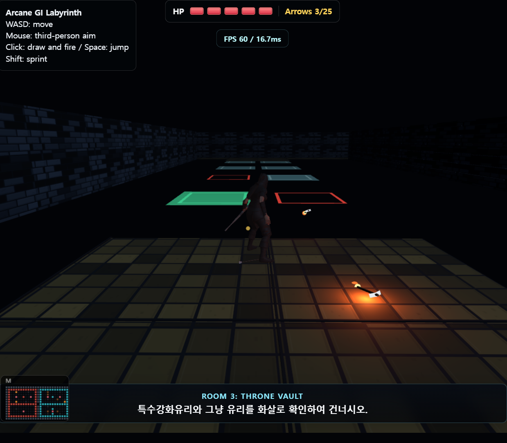

## 3. 강의 내용과 구현 내용 매핑

강의에서 다룬 그래픽스 요소를 게임 기능 안에 넣는 것을 목표로 했음. 코드 설명은 너무 길게 쓰기보다, 어떤 개념을 어떤 게임 기능으로 연결했는지 중심으로 정리함.

| 강의 내용 | 게임 구현 내용 |
| --- | --- |
| Scene Graph | `THREE.Scene` 안에 맵, 문, 캐릭터, 화살, 적, 퍼즐 오브젝트를 배치함. 활, 화살, 문, Paladin 모델은 `Group`으로 묶어서 위치와 회전을 같이 제어함. |
| Camera / Projection | 3인칭 플레이에 맞춰 `PerspectiveCamera`를 사용함. 카메라는 플레이어 뒤쪽을 따라오고, 플레이어 주변 목표 지점을 바라보게 만듦. |
| Geometry Modeling | 문자열 맵 데이터를 읽어서 벽, 바닥, 장애물, 돌기둥, 문, 유리 다리를 생성함. 기본 geometry를 조합해서 던전 구조를 만듦. |
| Material / Texture | 바닥과 벽은 벽돌 느낌이 나도록 재질을 조정했고, 유리는 투명 재질을 사용함. 룬, 불꽃, 안내 UI는 어두운 맵에서 잘 보이도록 밝은 색을 사용함. |
| Lighting | 기본 조명, 방향광, 횃불 조명, 불화살 조명을 같이 사용함. 렉이 심해져서 가까운 횃불과 최근 불화살만 실제 PointLight로 켜지게 제한함. |
| Transformation | 플레이어 이동, 문 열림, 유리 파괴, 화살 이동에 위치/회전/스케일 변환을 사용함. 문은 회전값을 보간해서 양쪽으로 열리게 만듦. |
| Quaternion | 화살이 날아가는 방향을 맞출 때 `mesh.quaternion.setFromUnitVectors()`를 사용함. 화살의 기본 방향을 속도 벡터 방향으로 돌리는 부분임. |
| Animation | 플레이어는 Mixamo 궁수 모델을 사용하고, Paladin은 FBX 애니메이션을 사용함. 이동, 공격, 피격, 사망 상태에 따라 animation action을 바꿈. |
| Collision Detection | 벽, 문, 돌기둥, 적, 유리, 바닥 충돌을 처리함. 화살은 이전 위치와 현재 위치 사이의 선분을 사용해서 빠르게 지나가도 맞을 수 있게 처리함. |
| Interaction / UI | WASD 이동, Shift 달리기, Space 점프, 좌클릭 발사, F 키 문 상호작용을 넣음. HP, 화살 개수, 방 목표, 문 안내, 사망/승리 UI도 넣음. |
| GI 기술 | 불화살이 표면에 박힌 위치에 작은 조명을 남겨 Surfel GI처럼 표면에서 빛이 퍼지는 느낌을 연출함. |

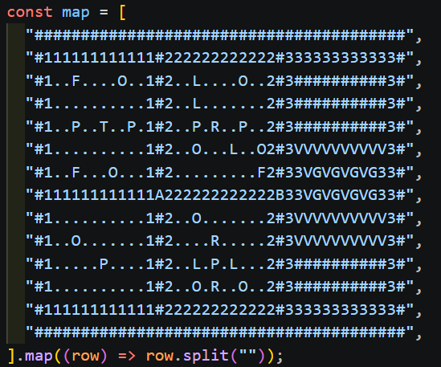

## 4. GI 기술 적용: Surfel GI 스타일 구현

이 프로젝트에서 선택한 GI 방식은 완전한 Surfel GI가 아니라 Surfel GI 스타일의 근사 연출임. 불화살이 벽, 바닥, 오브젝트 표면에 박히면 그 지점에 작은 PointLight를 남김. 표면에 남은 지점이 주변을 밝히기 때문에, 불화살이 간접광처럼 공간에 영향을 주는 느낌을 낼 수 있음.

완전한 Surfel GI를 구현하지 않은 이유도 있음. 실제 Surfel GI는 표면에 많은 surfel을 만들고, 각 surfel의 위치, 법선, 반사율, 가시성, 조명 기여도를 관리해야 함. 이걸 실시간으로 처리하려면 별도 GPU 버퍼, 셰이더, 공간 탐색 구조가 필요함. 이번 게임은 Three.js 기본 렌더링 위에서 Paladin FBX 애니메이션, 유리 다리, 충돌, UI까지 같이 돌아가야 했음. 실제로 PointLight와 SkinnedMesh가 많아지면 FPS가 떨어졌기 때문에, 과제 범위에서는 “표면에 남는 조명 기여점”이라는 핵심 아이디어를 게임 방식에 맞게 줄여서 구현함.

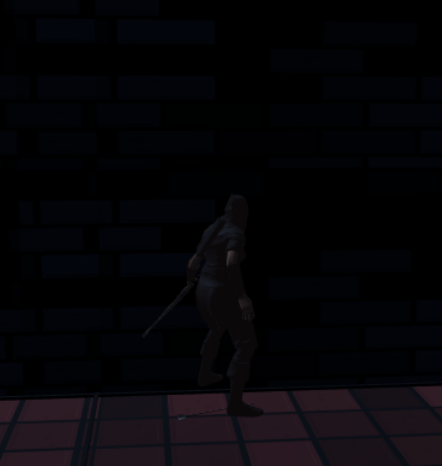

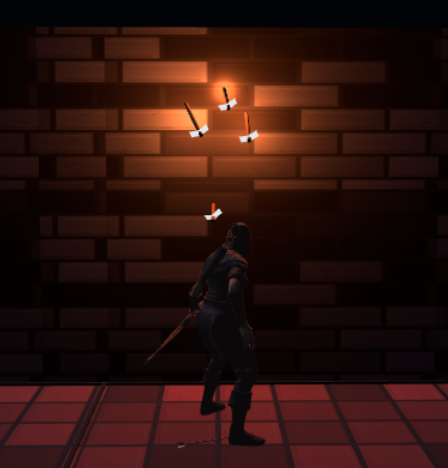

구현 방식은 다음과 같음.

- 불화살 발사 시 화살 mesh와 작은 PointLight를 같이 생성함.
- 화살이 벽, 바닥, 돌기둥, 유리 등에 충돌하면 이동을 멈춤.
- 벽이나 바닥에 박힌 화살은 일정 시간 동안 조명으로 남음.
- 오래된 화살 조명은 성능 때문에 최근 몇 개만 켜지게 제한함.
- 그래서 실제 GI는 아니지만, 표면 위치가 주변 조명에 기여하는 효과를 볼 수 있음.

## 5. 구현 상세 설명

### 5.1 맵 구조

맵은 문자열 배열로 관리함. 문자는 벽, 바닥, 문, 장애물, 유리, 공허, 퍼즐 오브젝트를 의미함. 이 방식은 방 구조를 바꾸기 쉬웠고, Room 1, Room 2, Room 3의 규칙을 분리해서 관리하기 좋았음.


### 5.2 플레이어 시스템

플레이어는 3인칭 카메라로 조작함. 이동, 달리기, 점프, 조준, 화살 발사를 지원함. HP는 5칸으로 구성했고, Paladin의 검 공격에 맞으면 HP가 줄어듦. HP가 0이 되면 궁수 사망 애니메이션을 재생하고, 이후 You Died 화면과 Regame 버튼을 보여줌.


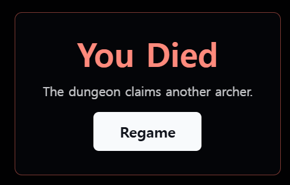

### 5.3 화살 시스템

화살은 직선으로만 날아가지 않고 포물선 운동을 하도록 구현함. 매 프레임 중력값을 적용해서 시간이 지날수록 아래로 떨어짐. 화살은 벽, 바닥, 돌기둥, 적, 유리와 충돌함. Room 3에서는 화살 개수를 제한해서 유리를 무작정 다 쏘는 방식이 아니라, 판단하면서 건너야 하게 만듦.


### 5.4 Paladin AI

Paladin은 방 단위로 움직임. 플레이어가 같은 방에 있을 때만 추적하고, 다른 방으로 넘어가면 더 이상 따라오지 않고 자기 위치로 돌아감. 공격 모션이 시작되면 이동을 멈추고 검을 휘두르게 했음. 처음에는 공격 중에도 따라와서 어색했기 때문에, 공격 상태에서는 추적 이동을 잠깐 멈추도록 수정함.

공격 판정은 단순히 가까우면 맞는 방식이 아니라, 공격 모션의 유효 타이밍과 플레이어와의 거리/방향 조건을 같이 사용함. 그래서 플레이어가 공격 범위 밖으로 피하면 HP가 줄지 않음.

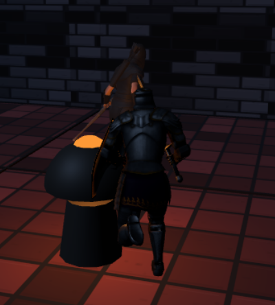

### 5.5 문 UI

문 앞에 가까이 가면 `Press F to go through` 안내가 뜸. Room 1과 Room 2 문은 조건을 만족해야 열림. 조건이 부족하면 바로 넘어가지 않고 안내 메시지나 입력창을 보여줌.

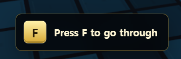

### 5.6 Room 1 퍼즐 구현

Room 1의 세 돌기둥은 각각 불화살 충돌을 감지함. 화살이 돌기둥에 맞으면 기둥 위에 불꽃과 조명이 켜짐. 세 기둥이 모두 켜지면 Room 2 문이 열림. 이 장면은 불화살, 충돌 판정, PointLight, 문 상태 변화가 한 번에 연결되는 구간임.


### 5.7 Room 2 룬 퍼즐 구현

Room 2의 경비병은 각각 룬 문자를 가지고 있음. 경비병이 죽으면 해당 위치 위에 룬을 띄움. 룬은 기억해야 하는 정보이기 때문에 시체나 바닥 텍스처에 묻히면 안 됐음. 그래서 홀로그램처럼 공중에 보이게 바꿨음.


### 5.8 Room 3 유리 다리 구현

Room 3은 좌우 선택형 유리 다리임. 안전한 유리와 깨지는 유리를 섞어두고, 플레이어가 화살로 먼저 확인할 수 있게 했음. 일반 유리는 화살에 맞으면 깨지고, 강화유리는 남아 있음. 플레이어가 약한 유리에 착지하면 유리가 깨지고, 추락 연출 후 사망 처리됨.


## 6. 완성도 및 개선 사항

완성한 기능은 다음과 같음.

- 3개 방으로 구성된 게임 진행
- 각 방마다 다른 퍼즐과 전투 규칙
- 3인칭 플레이어 조작
- Mixamo 기반 플레이어 모델 및 애니메이션
- Paladin 적 AI와 전투 시스템
- HP, 화살 개수, 문 안내, 방 목표 UI
- Room 3 유리 다리 최종 스테이지
- Surfel GI 스타일 불화살 조명 연출
- 게임 오버 및 승리 흐름

아쉬운 점도 있음. 실제 물리 기반 GI나 정교한 pathfinding까지는 구현하지 못했음. 대신 제출 범위 안에서 화면으로 바로 확인되는 GI 연출, 방 단위 AI, 퍼즐 진행 구조를 우선해서 완성함. 성능 문제도 있어서 최종 단계에서는 shadow, PointLight 개수, HUD 갱신 주기, Paladin 애니메이션 업데이트 거리 등을 조절해 FPS를 안정화함.

## 7. 실행 방법

로컬 실행 방법은 다음과 같음.

```bash
npm install
npm run dev
```

브라우저에서 출력된 로컬 주소 또는 제출한 웹 배포 링크로 접속하면 됨.

## 8. 제출 링크

- GitHub Repository: https://github.com/jeongyoungsuh/computer_graphics
- Web 실행 링크: https://jeongyoungsuh.github.io/computer_graphics/
- Report MD 링크: https://github.com/jeongyoungsuh/computer_graphics/blob/main/REPORT.md

## 9. 결론

이 프로젝트는 Three.js로 만든 3D 게임 안에 강의에서 배운 장면 구성, 모델링, 재질, 조명, 애니메이션, 충돌, UI, GI 개념을 넣어본 결과물임. 가장 중요하게 잡은 부분은 불화살이 표면에 박히고, 그 위치가 주변을 밝히는 Surfel GI 스타일 연출이었음. 여기에 Room 1 점화 퍼즐, Room 2 전투와 룬 기억, Room 3 유리 다리 판별을 붙여서 하나의 짧은 게임 흐름으로 마무리함.
